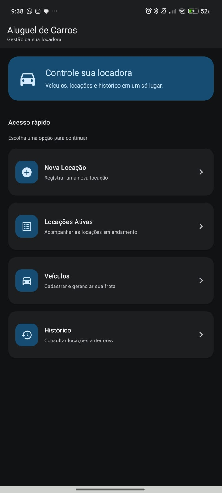
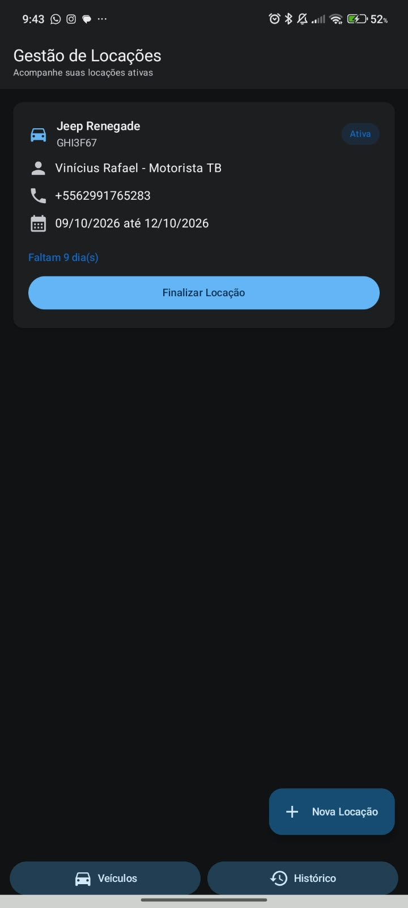
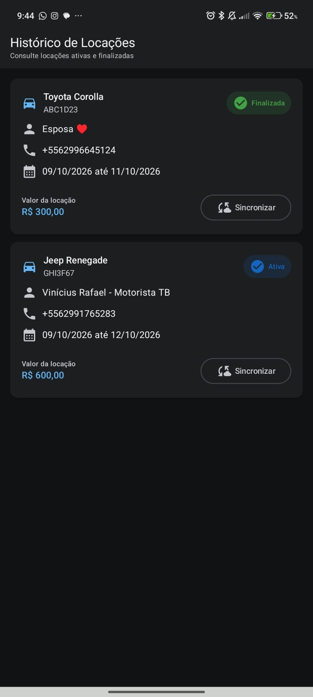
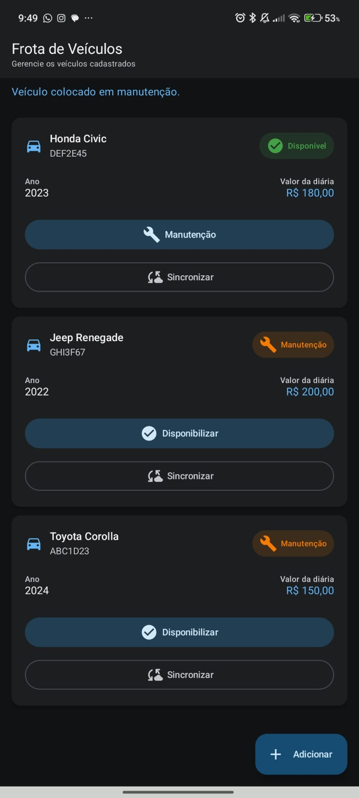

# Aluguel de Carros

Aplicativo Android desenvolvido para gerenciamento de uma pequena locadora de veículos.

O sistema permite cadastrar veículos, registrar locações, selecionar clientes através dos contatos do aparelho, acompanhar locações ativas, finalizar locações e consultar o histórico.

---

## Tecnologias utilizadas

- Kotlin
- Jetpack Compose
- Material 3
- MVVM
- Room Database 3
- Navigation Compose
- SavedStateHandle
- ContentProvider
- Retrofit 2
- OkHttp
- Coroutines
- Flow / StateFlow

---

## Arquitetura

O projeto foi organizado em três camadas principais:

```text
com.rafael.alugueldecarro

├── data
│   ├── local
│   ├── remote
│   └── repository
│
├── domain
│   ├── model
│   └── repository
│
└── ui
    ├── contato
    ├── dashboard
    ├── home
    ├── locacao
    ├── navigation
    ├── sync
    ├── theme
    └── veiculo
```

- **UI:** telas e ViewModels.
- **Domain:** modelos e contratos.
- **Data:** banco de dados, Retrofit e repositories.

---

## Funcionalidades

- Cadastro de veículos
- Listagem de veículos
- Controle de status dos veículos:
    - Disponível
    - Alugado
    - Manutenção
- Criação de locação
- Seleção de cliente pela agenda do aparelho
- Cálculo do valor da locação
- Visualização de locações ativas
- Finalização de locação
- Histórico de locações
- Persistência local com Room
- Sincronização utilizando Retrofit
- Suporte a tema claro e escuro

---

## Como executar

1. Clone o repositório.
2. Abra o projeto no Android Studio.
3. Aguarde a sincronização do Gradle.
4. Execute em um emulador ou dispositivo Android.
5. Permita o acesso aos contatos quando solicitado.

---

## Screenshots

### Home

Tela inicial do aplicativo com acesso às principais funcionalidades.



---

### Veículos

Tela responsável pelo gerenciamento da frota.


---

### Cadastro de Veículo

Tela utilizada para cadastrar novos veículos.


---

### Nova Locação

Tela utilizada para registrar uma nova locação.


---

### Seleção de Cliente

Tela que utiliza os contatos do aparelho para seleção do cliente.


---

### Locações Ativas

Tela responsável pelo acompanhamento das locações em andamento.



---

### Histórico

Tela utilizada para consulta das locações cadastradas.



---

### Veículo em Manutenção

Exemplo de veículo com status de manutenção.



---

### Veículo Alugado

Exemplo de veículo vinculado a uma locação ativa.


---

## Autor

Rafael Borba Wolney