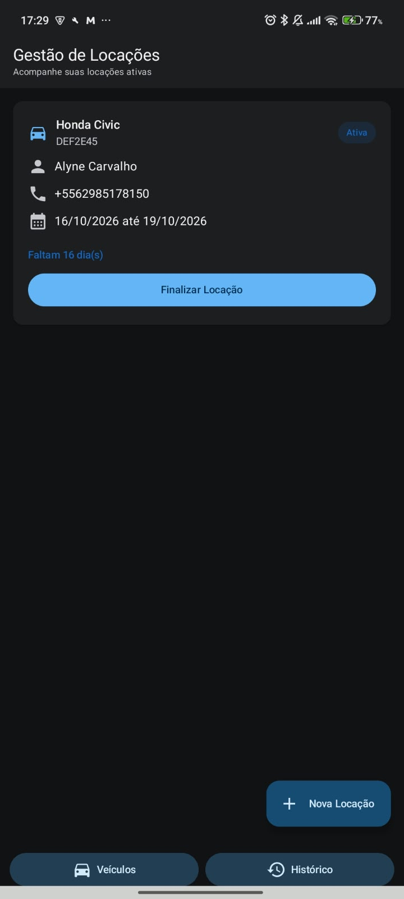
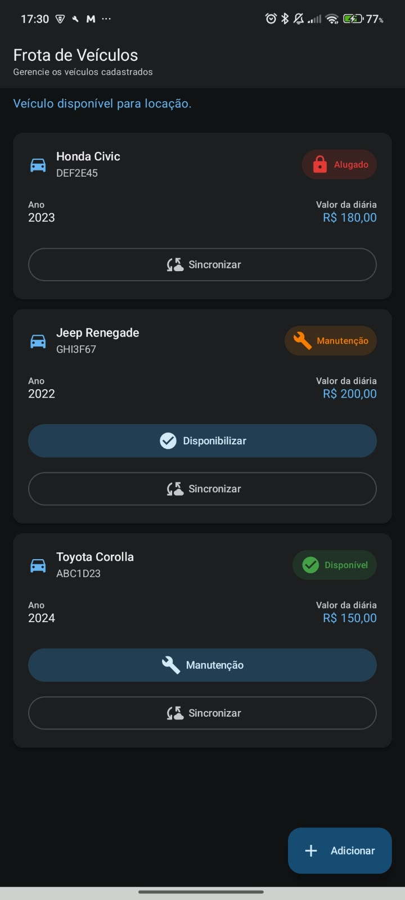
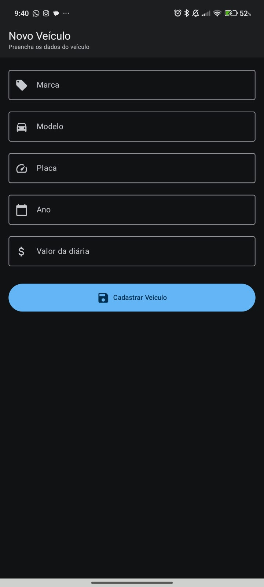
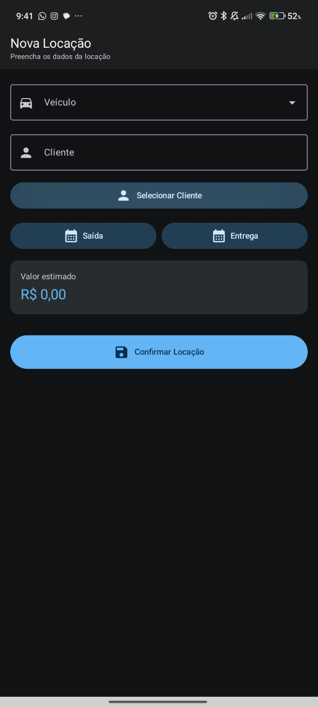
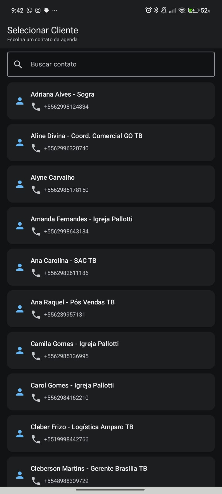
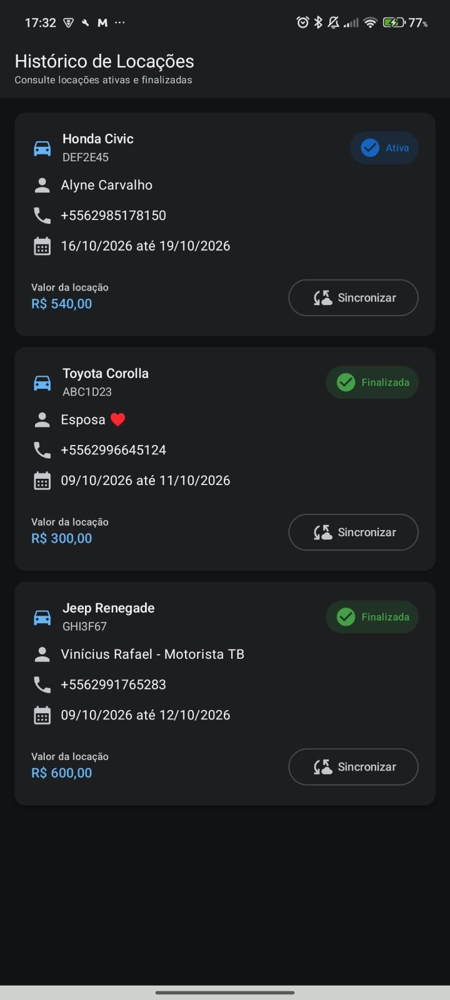
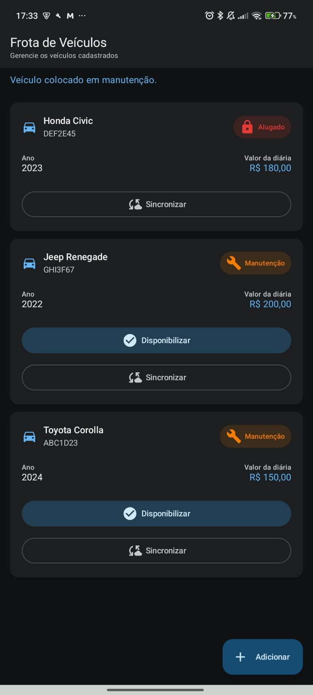
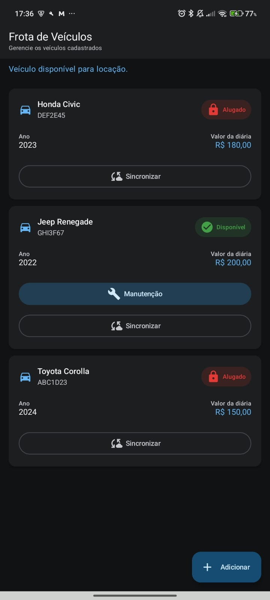

# Aluguel de Carros

Aplicativo Android nativo desenvolvido para gerenciamento de uma pequena locadora de veículos.

O sistema permite cadastrar veículos, registrar locações, selecionar clientes através dos contatos do aparelho, acompanhar locações ativas, finalizar locações e consultar o histórico.

---

## Tecnologias utilizadas

- Kotlin
- Jetpack Compose
- Material Design 3
- MVVM
- Room Database 3
- Navigation Compose
- SavedStateHandle
- ContentProvider
- Retrofit 2
- OkHttp
- Kotlin Coroutines
- Flow
- StateFlow

---

## Arquitetura

O projeto foi organizado em três camadas principais:

```text
com.rafael.alugueldecarro

├── data
│   ├── local
│   ├── remote
│   └── repository
│
├── domain
│   ├── model
│   └── repository
│
└── ui
    ├── contato
    ├── dashboard
    ├── locacao
    ├── navigation
    ├── sync
    ├── theme
    └── veiculo
```

- **UI:** telas desenvolvidas com Jetpack Compose e ViewModels.
- **Domain:** modelos e contratos utilizados pelas regras da aplicação.
- **Data:** persistência local, comunicação remota e implementações dos repositories.

---

## Funcionalidades

### Gestão de Locações — Dashboard

O aplicativo inicia diretamente na tela de **Gestão de Locações**.

O Dashboard apresenta apenas as locações com status **ATIVA**.

Cada locação apresenta:

- marca, modelo e placa do veículo;
- nome e telefone do cliente;
- data de saída;
- data prevista de entrega;
- quantidade de dias restantes;
- destaque visual para locações em atraso.

Também é disponibilizado um botão flutuante para iniciar uma **Nova Locação**.

---

### Frota de Veículos

A tela **Frota de Veículos** permite:

- visualizar os veículos cadastrados;
- consultar marca, modelo, placa, ano e valor da diária;
- visualizar o status atual do veículo;
- colocar veículos disponíveis em manutenção;
- disponibilizar novamente veículos em manutenção.

Os status utilizados são:

- **Disponível**
- **Alugado**
- **Manutenção**

Ao ser cadastrado, o veículo entra automaticamente com status **Disponível**.

Veículos alugados ou em manutenção não ficam disponíveis para novas locações.

---

### Novo Veículo

O formulário de cadastro possui os campos:

- Marca
- Modelo
- Placa
- Ano
- Valor da diária

As validações incluem:

- todos os campos são obrigatórios;
- placa no padrão antigo `AAA-1234` ou Mercosul `AAA1A23`;
- valor da diária deve ser numérico e maior que zero.

---

### Selecionar Cliente

A seleção de cliente utiliza os contatos cadastrados no dispositivo Android através do `ContentProvider`.

O aplicativo solicita em tempo de execução a permissão:

`READ_CONTACTS`

Caso o usuário negue a permissão, é apresentada uma mensagem explicativa com opção para tentar novamente ou acessar as configurações do aplicativo.

A tela também permite filtrar os contatos por nome.

Ao selecionar um contato, são utilizados:

- nome;
- telefone;
- ID do contato.

---

### Nova Locação

Na tela de **Nova Locação** é possível:

- selecionar apenas veículos com status **Disponível**;
- selecionar um cliente através da agenda do aparelho;
- selecionar a data de saída;
- selecionar a data prevista de entrega;
- visualizar automaticamente o valor estimado.

O cálculo utiliza:

`Quantidade de dias x Valor da diária`

Ao confirmar a locação:

- a locação é salva com status **ATIVA**;
- o veículo passa automaticamente para o status **ALUGADO**;
- a navegação retorna ao Dashboard somente após a conclusão da gravação;
- a nova locação passa a aparecer na lista de locações ativas.

---

### Finalização de Locação

Uma locação ativa pode ser finalizada diretamente pelo Dashboard.

Ao finalizar:

- a locação deixa de aparecer na lista de locações ativas;
- o veículo volta automaticamente para o status **Disponível**;
- a locação permanece disponível no histórico.

---

### Histórico de Locações

A tela **Histórico de Locações** permite consultar as locações registradas no aplicativo.

São apresentados:

- veículo;
- placa;
- cliente;
- telefone;
- período da locação;
- valor total;
- status da locação.

---

### Sincronização

O projeto possui uma camada de comunicação REST utilizando **Retrofit 2**.

Para fins acadêmicos, a API foi mockada utilizando um interceptor do OkHttp.

A estrutura permite a sincronização de:

- veículos;
- locações.

---

## Persistência de Dados

O aplicativo utiliza **Room Database 3** para persistência local.

As principais entidades são:

- `VeiculoEntity`
- `ClienteEntity`
- `LocacaoEntity`

A locação possui relacionamento com veículo e cliente utilizando:

- `@ForeignKey`
- `@Relation`

Os dados permanecem armazenados localmente mesmo após o aplicativo ser fechado e aberto novamente.

---

## Gerenciamento de Estado e Assincronismo

Os ViewModels utilizam:

- StateFlow
- Flow
- Kotlin Coroutines

As telas observam os estados utilizando:

`collectAsStateWithLifecycle()`

Também são tratados estados de:

- carregamento;
- erro;
- lista vazia.

---

## Navegação

O aplicativo utiliza **Navigation Compose** em estrutura **Single Activity**.

Fluxo principal:

```text
Dashboard
│
├── Nova Locação
│   └── Selecionar Cliente
│
├── Frota de Veículos
│   └── Novo Veículo
│
└── Histórico de Locações
```

O retorno do contato selecionado para a tela de Nova Locação utiliza `SavedStateHandle`.

---

## Como executar

1. Clone o repositório.
2. Abra o projeto no Android Studio.
3. Aguarde a sincronização do Gradle.
4. Execute o projeto em um dispositivo físico ou emulador Android.
5. Ao acessar a seleção de clientes, conceda a permissão de leitura dos contatos.

---

## Screenshots

### Gestão de Locações — Dashboard

Tela inicial do aplicativo com as locações ativas.



---

### Frota de Veículos

Tela responsável pelo gerenciamento da frota.



---

### Novo Veículo

Formulário utilizado para cadastrar um novo veículo.



---

### Nova Locação

Tela utilizada para registrar uma nova locação.



---

### Selecionar Cliente

Tela integrada aos contatos do dispositivo Android.



---

### Histórico de Locações

Tela utilizada para consultar as locações cadastradas.



---

### Veículo em Manutenção

Exemplo de veículo com status **Manutenção**.



---

### Veículo Alugado

Exemplo de veículo vinculado a uma locação ativa.



---

## Requisitos Técnicos Implementados

- [x] Aplicativo Android nativo
- [x] Kotlin
- [x] Jetpack Compose
- [x] Material Design 3
- [x] Arquitetura MVVM
- [x] Separação em UI / Domain / Data
- [x] Room Database 3
- [x] Três tabelas principais
- [x] Relacionamentos com `@ForeignKey`
- [x] Relacionamentos com `@Relation`
- [x] Repository Pattern
- [x] StateFlow
- [x] Flow
- [x] Kotlin Coroutines
- [x] Navigation Compose
- [x] Single Activity
- [x] SavedStateHandle
- [x] ContentProvider
- [x] ContentResolver
- [x] Runtime Permission para contatos
- [x] Retrofit 2
- [x] API REST mockada
- [x] Tratamento de carregamento
- [x] Tratamento de erro
- [x] Tratamento de estado vazio
- [x] Suporte a tema claro e escuro

---

## APK

A versão compilada do aplicativo está disponível na seção **Releases** do repositório.

Versão atual:

`v1.0.0`

Arquivo:

`AluguelDeCarros-v1.0.0.apk`

---

## Configuração do Projeto

```text
minSdk: 26
targetSdk: 36
compileSdk: 37.1
```

---

## Autor

Rafael Borba Wolney